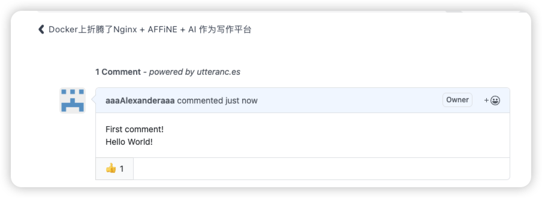
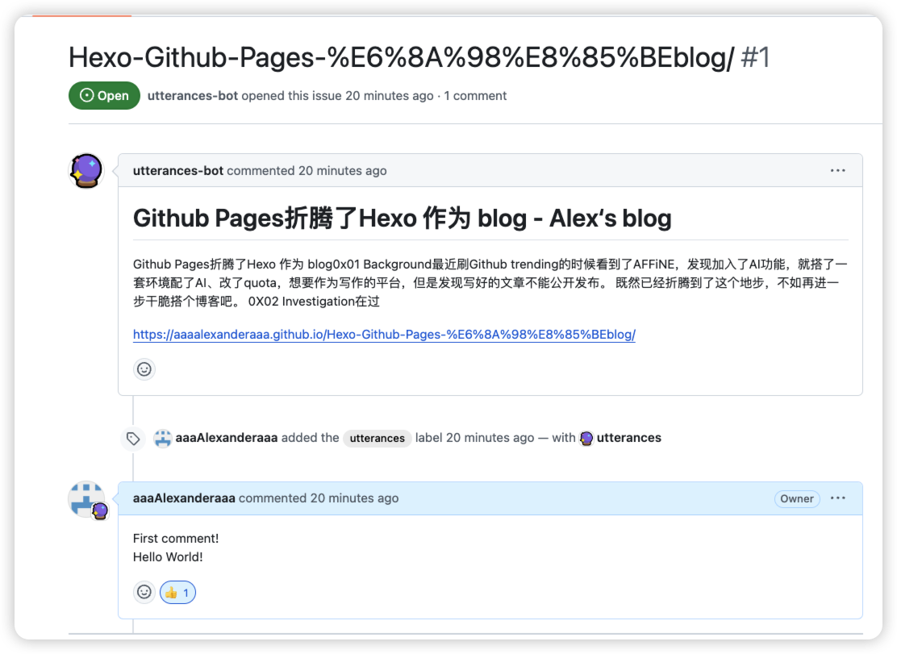

# Hexo + Fluid 配置优化

# 0x01 Background


之前用[Github Pages折腾了Hexo 作为 blog](https://aaaalexanderaaa.github.io/Hexo-Github-Pages-%E6%8A%98%E8%85%BEblog/)，发现有点简陋，于是新增了一些配置，完善其作为一个blog的基本能力。

* 网站所有权验证
* 站点地图
* 搜索引擎收录
* RSS
* 评论功能
* robots.txt


## 0x02 Implementation

### 01 网站所有权验证

Why ：验证了网站所有者，可以访问该网站的 Google 搜索不公开数据，帮助更好的管理网站

[Google Search Console](https://search.google.com/search-console)

我选择的是子域名->文件验证，把对应的文件放在source 目录下，在 \_config.yml中配置skip\_render就可以验证了，否则会自动渲染，Google认证失败。

形如：`skip_render: [googletest.html]`

### 02 站点地图

Why：配了站点地图可以帮google索引网站，使它全面建立链接

我只考虑了Google，没考虑百度索引。BTW，hexo-generator-baidu-sitemap 在 npm info中的仓库已经404了，安装的时候给我报了一堆漏洞。

```
npm install --save hexo-generator-sitemap
```

配一下\_config.yml

```
sitemap:
  path: sitemap.xml
```

### 03 搜索引擎收录

Why：同上，直接给google站点地图就行

谷歌操作比较简单，就是向[Google Search Console](https://search.google.com/search-console)提交sitemap

### 04 RSS

Why：虽然是个新博客，但是rss配一下说不准有人订阅呢。另外你还可以把自己的rss认证到follow，好处就是头像边上有个标。

```
npm install hexo-generator-feed --save
```

同样的，配一下\_config.yml

```
# RSS feed
feed:
  type: atom
  path: atom.xml
  limit: 20 # 最大文章数量
  content: false # 是否显示内文
```

### 05 评论功能

Why：要是博客没有feedback的话，未免有点太单调了

用的是fluid自带的功能，用的utterances插件，通过github issue来跟踪评论。

1. 需要在repo 安装这个app，允许utterances管理这个repo的issue（不用选全部repo）
2. 在\_config.fluid.yml里把comments enable改成true, type改成utterances, 在下面的配置项中指定你对应的repo就可以了

以下是效果图，有点丑……Nevermind，还要啥自行车





### 06 robots.txt

和配置Google文件验证一样，创建robots.txt放在source目录下就行了

```
# hexo robots.txt
User-agent: *
Allow: /
Allow: /archives/
Allow: /tags/
Allow: /categories/
Allow: /about/

Disallow: /vendors/
Disallow: /js/
Disallow: /css/
Disallow: /fonts/
Disallow: /fancybox/

Sitemap: https://aaaalexanderaaa.github.io/sitemap.xml
```

## 0x03 Reflections

配置很快，甚至都没有我写这篇blog的时间长。

想配个访问统计来着，但是好像对我这个小网站来说有点不必要了，就还没配。


## 0x99 References

1. https://fuhailin.github.io/Hexo-SEO/
2. https://www.qooo.tech/hexo/theme-shokax/
3. https://hexo.fluid-dev.com/docs/guide/
